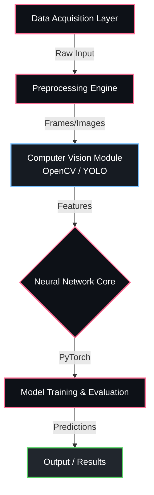

<div align="center">


<p align="center">
  
  
  
  
</p>

  
  


</div>

---

## Overview

> Reinforcement learning agent that learns complex behaviors from expert demos.

**Adversarial Inverse Reinforcement Learning system ** is a proprietary machine learning / ai system engineered by **Karthik Idikuda**. It leverages OpenCV, PyTorch for its core functionality.

<br/>

## System Architecture



<br/>

## Project Structure

```
Adversarial-Inverse-Reinforcement-Learning-system-/
  .DS_Store
  LICENSE
  Makefile
  README.md
  README_COMPLETE.md
  STATUS.md
  adversarial_irl_demo.ipynb
  adversarial_irl_gradio.py
  adversarial_irl_gui.py
  adversarial_irl_web.py
  __pycache__/
    complete_navigation_test.cpython-39-pytest-8.4.1.pyc
    complete_navigation_test.cpython-39.pyc
    fixed_train_complete.cpython-39.pyc
  config/
    __init__.py
    fixed_config.py
  configs/
    irl_config.yaml
    navigation_config.yaml
    sensor_config.yaml
  data/
  docs/
  examples/
  src/
  tests/
```

<br/>

## Technical Specifications

| Attribute | Detail |
|:---|:---|
| **Primary Language** | `Python` |
| **Project Category** | `Machine Learning / AI` |
| **Total Source Files** | `586` |
| **Frameworks** | `OpenCV`, `PyTorch` |
| **Key Dependencies** | `torch` | `numpy` | `scikit-learn` | `pyyaml` | `gymnasium` | `seaborn` | `scipy` | `pillow` | `tqdm` | `opencv-python` | `matplotlib` | `wandb` | `tensorboard` | `torchvision` |
| **Intellectual Property** | `Strictly Proprietary` |

<br/>

## STRICT LEGAL WARNING & LICENSE

> **PROPRIETARY AND CONFIDENTIAL**

This software and all associated documentation are the **exclusive property of Karthik Idikuda**.

- **NO PERMISSION IS GRANTED** to use, copy, modify, merge, publish, distribute, sublicense, or sell copies of this software without explicit, written consent from the author.
- **UNAUTHORIZED USE WILL RESULT IN SEVERE LEGAL ACTION.** Any individual or organization found using, referencing, or deploying this code without paying the required licensing fees will face immediate litigation, financial penalties, and potentially criminal prosecution where applicable by law.
- **TO OBTAIN A LEGAL LICENSE**, you must directly contact Karthik Idikuda to negotiate payment terms.

*By accessing this repository, you acknowledge and accept these strict proprietary terms.*

---

<div align="center">
  
</div>

<!-- TRACKING: S0ktQWR2ZXJzYXJpYWwtSW52ZXJzZS1SZWluZm9yY2VtZW50LUxlYXJuaW5nLXN5c3RlbS0tVFJBQ0s= -->
