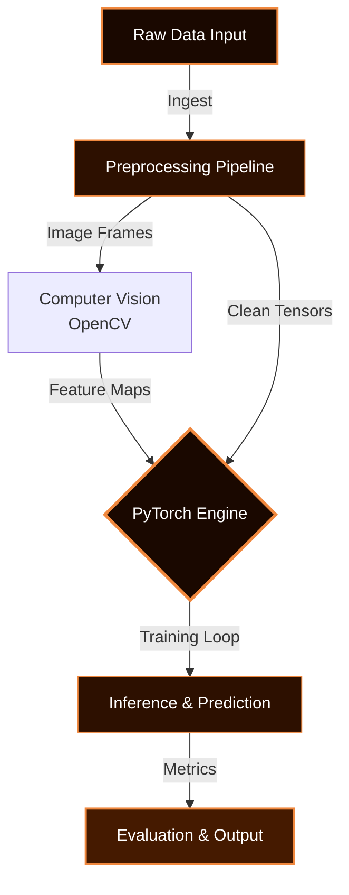

<div align="center">

![Header](data:image/svg+xml;base64,PHN2ZyB3aWR0aD0iODAwIiBoZWlnaHQ9IjIwMCIgdmlld0JveD0iMCAwIDgwMCAyMDAiIHhtbG5zPSJodHRwOi8vd3d3LnczLm9yZy8yMDAwL3N2ZyI+CiAgPGRlZnM+CiAgICA8bGluZWFyR3JhZGllbnQgaWQ9ImJnIiB4MT0iMCUiIHkxPSIwJSIgeDI9IjEwMCUiIHkyPSIxMDAlIj4KICAgICAgPHN0b3Agb2Zmc2V0PSIwJSIgc3RvcC1jb2xvcj0iIzFhMDgwMCIvPgogICAgICA8c3RvcCBvZmZzZXQ9IjUwJSIgc3RvcC1jb2xvcj0iIzJkMTAwMCIvPgogICAgICA8c3RvcCBvZmZzZXQ9IjEwMCUiIHN0b3AtY29sb3I9IiM0NTFhMDAiLz4KICAgIDwvbGluZWFyR3JhZGllbnQ+CiAgICA8ZmlsdGVyIGlkPSJnbG93Ij4KICAgICAgPGZlR2F1c3NpYW5CbHVyIHN0ZERldmlhdGlvbj0iNCIgcmVzdWx0PSJiIi8+CiAgICAgIDxmZUNvbXBvc2l0ZSBpbj0iU291cmNlR3JhcGhpYyIgaW4yPSJiIiBvcGVyYXRvcj0ib3ZlciIvPgogICAgPC9maWx0ZXI+CiAgICA8ZmlsdGVyIGlkPSJnbG93MiI+CiAgICAgIDxmZUdhdXNzaWFuQmx1ciBzdGREZXZpYXRpb249IjgiIHJlc3VsdD0iYiIvPgogICAgICA8ZmVDb21wb3NpdGUgaW49IlNvdXJjZUdyYXBoaWMiIGluMj0iYiIgb3BlcmF0b3I9Im92ZXIiLz4KICAgIDwvZmlsdGVyPgogIDwvZGVmcz4KICA8cmVjdCB3aWR0aD0iMTAwJSIgaGVpZ2h0PSIxMDAlIiBmaWxsPSJ1cmwoI2JnKSIgcng9IjEyIi8+CiAgCiAgPCEtLSBHcmlkIGxpbmVzIC0tPgogIDxsaW5lIHgxPSIwIiB5MT0iNTAiIHgyPSI4MDAiIHkyPSI1MCIgc3Ryb2tlPSIjZjA4ODNlIiBvcGFjaXR5PSIwLjA1IiBzdHJva2Utd2lkdGg9IjEiLz4KICA8bGluZSB4MT0iMCIgeTE9IjEwMCIgeDI9IjgwMCIgeTI9IjEwMCIgc3Ryb2tlPSIjZjA4ODNlIiBvcGFjaXR5PSIwLjA1IiBzdHJva2Utd2lkdGg9IjEiLz4KICA8bGluZSB4MT0iMCIgeTE9IjE1MCIgeDI9IjgwMCIgeTI9IjE1MCIgc3Ryb2tlPSIjZjA4ODNlIiBvcGFjaXR5PSIwLjA1IiBzdHJva2Utd2lkdGg9IjEiLz4KICA8bGluZSB4MT0iMjAwIiB5MT0iMCIgeDI9IjIwMCIgeTI9IjIwMCIgc3Ryb2tlPSIjZjA4ODNlIiBvcGFjaXR5PSIwLjA1IiBzdHJva2Utd2lkdGg9IjEiLz4KICA8bGluZSB4MT0iNDAwIiB5MT0iMCIgeDI9IjQwMCIgeTI9IjIwMCIgc3Ryb2tlPSIjZjA4ODNlIiBvcGFjaXR5PSIwLjA1IiBzdHJva2Utd2lkdGg9IjEiLz4KICA8bGluZSB4MT0iNjAwIiB5MT0iMCIgeDI9IjYwMCIgeTI9IjIwMCIgc3Ryb2tlPSIjZjA4ODNlIiBvcGFjaXR5PSIwLjA1IiBzdHJva2Utd2lkdGg9IjEiLz4KICAKICAKICA8Y2lyY2xlIGN4PSI2NjAiIGN5PSIzMCIgcj0iMiIgZmlsbD0iI2YwODgzZSIgb3BhY2l0eT0iMC42Ij4KICAgIDxhbmltYXRlIGF0dHJpYnV0ZU5hbWU9ImN4IiB2YWx1ZXM9IjY2MDsgMTQwOyA2NjAiIGR1cj0iNnMiIHJlcGVhdENvdW50PSJpbmRlZmluaXRlIiAvPgogICAgPGFuaW1hdGUgYXR0cmlidXRlTmFtZT0ib3BhY2l0eSIgdmFsdWVzPSIwLjM7IDAuOTsgMC4zIiBkdXI9IjdzIiByZXBlYXRDb3VudD0iaW5kZWZpbml0ZSIgLz4KICA8L2NpcmNsZT4KICA8Y2lyY2xlIGN4PSI0MjAiIGN5PSI1NSIgcj0iMyIgZmlsbD0iI2YwODgzZSIgb3BhY2l0eT0iMC42Ij4KICAgIDxhbmltYXRlIGF0dHJpYnV0ZU5hbWU9ImN4IiB2YWx1ZXM9IjQyMDsgMzgwOyA0MjAiIGR1cj0iN3MiIHJlcGVhdENvdW50PSJpbmRlZmluaXRlIiAvPgogICAgPGFuaW1hdGUgYXR0cmlidXRlTmFtZT0ib3BhY2l0eSIgdmFsdWVzPSIwLjM7IDAuOTsgMC4zIiBkdXI9IjhzIiByZXBlYXRDb3VudD0iaW5kZWZpbml0ZSIgLz4KICA8L2NpcmNsZT4KICA8Y2lyY2xlIGN4PSI2MjAiIGN5PSI4MCIgcj0iNCIgZmlsbD0iI2YwODgzZSIgb3BhY2l0eT0iMC42Ij4KICAgIDxhbmltYXRlIGF0dHJpYnV0ZU5hbWU9ImN4IiB2YWx1ZXM9IjYyMDsgMTgwOyA2MjAiIGR1cj0iNHMiIHJlcGVhdENvdW50PSJpbmRlZmluaXRlIiAvPgogICAgPGFuaW1hdGUgYXR0cmlidXRlTmFtZT0ib3BhY2l0eSIgdmFsdWVzPSIwLjM7IDAuOTsgMC4zIiBkdXI9IjVzIiByZXBlYXRDb3VudD0iaW5kZWZpbml0ZSIgLz4KICA8L2NpcmNsZT4KICA8Y2lyY2xlIGN4PSIyMjAiIGN5PSIxMDUiIHI9IjIiIGZpbGw9IiNmMDg4M2UiIG9wYWNpdHk9IjAuNiI+CiAgICA8YW5pbWF0ZSBhdHRyaWJ1dGVOYW1lPSJjeCIgdmFsdWVzPSIyMjA7IDU4MDsgMjIwIiBkdXI9IjZzIiByZXBlYXRDb3VudD0iaW5kZWZpbml0ZSIgLz4KICAgIDxhbmltYXRlIGF0dHJpYnV0ZU5hbWU9Im9wYWNpdHkiIHZhbHVlcz0iMC4zOyAwLjk7IDAuMyIgZHVyPSI3cyIgcmVwZWF0Q291bnQ9ImluZGVmaW5pdGUiIC8+CiAgPC9jaXJjbGU+CiAgPGNpcmNsZSBjeD0iNDIwIiBjeT0iMTMwIiByPSIzIiBmaWxsPSIjZjA4ODNlIiBvcGFjaXR5PSIwLjYiPgogICAgPGFuaW1hdGUgYXR0cmlidXRlTmFtZT0iY3giIHZhbHVlcz0iNDIwOyAzODA7IDQyMCIgZHVyPSI1cyIgcmVwZWF0Q291bnQ9ImluZGVmaW5pdGUiIC8+CiAgICA8YW5pbWF0ZSBhdHRyaWJ1dGVOYW1lPSJvcGFjaXR5IiB2YWx1ZXM9IjAuMzsgMC45OyAwLjMiIGR1cj0iNnMiIHJlcGVhdENvdW50PSJpbmRlZmluaXRlIiAvPgogIDwvY2lyY2xlPgogIDxjaXJjbGUgY3g9IjQ2MCIgY3k9IjE1NSIgcj0iNCIgZmlsbD0iI2YwODgzZSIgb3BhY2l0eT0iMC42Ij4KICAgIDxhbmltYXRlIGF0dHJpYnV0ZU5hbWU9ImN4IiB2YWx1ZXM9IjQ2MDsgMzQwOyA0NjAiIGR1cj0iN3MiIHJlcGVhdENvdW50PSJpbmRlZmluaXRlIiAvPgogICAgPGFuaW1hdGUgYXR0cmlidXRlTmFtZT0ib3BhY2l0eSIgdmFsdWVzPSIwLjM7IDAuOTsgMC4zIiBkdXI9IjhzIiByZXBlYXRDb3VudD0iaW5kZWZpbml0ZSIgLz4KICA8L2NpcmNsZT4KICAKICA8IS0tIFNjYW5uaW5nIGxpbmUgLS0+CiAgPHJlY3QgeD0iMCIgeT0iMCIgd2lkdGg9IjgwMCIgaGVpZ2h0PSIzIiBmaWxsPSIjZjA4ODNlIiBvcGFjaXR5PSIwLjMiPgogICAgPGFuaW1hdGUgYXR0cmlidXRlTmFtZT0ieSIgdmFsdWVzPSIwOyAyMDA7IDAiIGR1cj0iNnMiIHJlcGVhdENvdW50PSJpbmRlZmluaXRlIi8+CiAgPC9yZWN0PgogIAogIDx0ZXh0IHg9IjUwJSIgeT0iNDIlIiBmb250LWZhbWlseT0iQXJpYWwsc2Fucy1zZXJpZiIgZm9udC13ZWlnaHQ9ImJvbGQiIGZvbnQtc2l6ZT0iMzgiIGZpbGw9IiNmMDg4M2UiIHRleHQtYW5jaG9yPSJtaWRkbGUiIGZpbHRlcj0idXJsKCNnbG93KSIgc3R5bGU9ImxldHRlci1zcGFjaW5nOjRweCI+CiAgICBBRFZFUlNBUklBTCBJTlZFUlNFIFJFSU5GTwogIDwvdGV4dD4KICA8dGV4dCB4PSI1MCUiIHk9IjYyJSIgZm9udC1mYW1pbHk9IkFyaWFsLHNhbnMtc2VyaWYiIGZvbnQtc2l6ZT0iMTMiIGZpbGw9IiNmZmFiNzAiIHRleHQtYW5jaG9yPSJtaWRkbGUiIHN0eWxlPSJsZXR0ZXItc3BhY2luZzozcHg7b3BhY2l0eTowLjgiPgogICAgUFJPUFJJRVRBUlkgUFlUSE9OIEFSQ0hJVEVDVFVSRQogIDwvdGV4dD4KICAKICA8IS0tIEJvdHRvbSBhY2NlbnQgbGluZSAtLT4KICA8bGluZSB4MT0iMjUwIiB5MT0iMTc1IiB4Mj0iNTUwIiB5Mj0iMTc1IiBzdHJva2U9IiNmMDg4M2UiIHN0cm9rZS13aWR0aD0iMiIgZmlsdGVyPSJ1cmwoI2dsb3cpIj4KICAgIDxhbmltYXRlIGF0dHJpYnV0ZU5hbWU9IngxIiB2YWx1ZXM9IjI1MDszMDA7MjUwIiBkdXI9IjNzIiByZXBlYXRDb3VudD0iaW5kZWZpbml0ZSIvPgogICAgPGFuaW1hdGUgYXR0cmlidXRlTmFtZT0ieDIiIHZhbHVlcz0iNTUwOzUwMDs1NTAiIGR1cj0iM3MiIHJlcGVhdENvdW50PSJpbmRlZmluaXRlIi8+CiAgPC9saW5lPgo8L3N2Zz4=)

<br/>

<p align="center">
  
  
  
  
</p>

  
  

<br/>


</div>

---

## Overview

> Reinforcement learning agent that learns complex behaviors from expert demos.

**Adversarial Inverse Reinforcement Learning system ** is an advanced machine learning / ai system engineered by **Karthik Idikuda**. Built with OpenCV, PyTorch.

<br/>

## System Architecture



<br/>

## Project Structure

```
Adversarial-Inverse-Reinforcement-Learning-system-/
  .DS_Store
  LICENSE
  Makefile
  README.md
  README_COMPLETE.md
  STATUS.md
  adversarial_irl_demo.ipynb
  adversarial_irl_gradio.py
  __pycache__/
    complete_navigation_test.cpython-39-pytest-8.4.1.pyc
    complete_navigation_test.cpython-39.pyc
    fixed_train_complete.cpython-39.pyc
  config/
    __init__.py
    fixed_config.py
  configs/
    irl_config.yaml
    navigation_config.yaml
    sensor_config.yaml
  data/
  docs/
  examples/
  src/
  tests/
```

<br/>

## Technical Specifications

| Attribute | Detail |
|:---|:---|
| **Primary Language** | `Python` |
| **Project Category** | `Machine Learning / AI` |
| **Total Source Files** | `586` |
| **Frameworks** | `OpenCV`, `PyTorch` |
| **IP Status** | `Strictly Proprietary` |

## Dependencies

<p align="left">
  <code>torch</code>  <code>numpy</code>  <code>scikit-learn</code>  <code>pyyaml</code>  <code>gymnasium</code>  <code>seaborn</code>  <code>scipy</code>  <code>pillow</code>  <code>tqdm</code>  <code>opencv-python</code>  <code>matplotlib</code>  <code>wandb</code>  <code>tensorboard</code>  <code>torchvision</code>
</p>


## STRICT LEGAL WARNING

> **PROPRIETARY AND CONFIDENTIAL**

This software is the **exclusive property of Karthik Idikuda**.

- **NO PERMISSION** to use, copy, modify, or distribute without written consent.
- **UNAUTHORIZED USE** results in litigation, financial penalties, and criminal prosecution.
- **LICENSING:** Contact Karthik Idikuda directly to negotiate terms.

*By viewing this repository, you accept these proprietary terms.*

---

<div align="center">
  <br/>
  
</div>

<!-- WATERMARK: S0ktUFJPUFJJRVRBUlktQWR2ZXJzYXJpYWwtSW52ZXJzZS1SZWluZm9yY2VtZW50LUxlYXJuaW5nLXN5c3RlbS0tMjAyNg== -->
